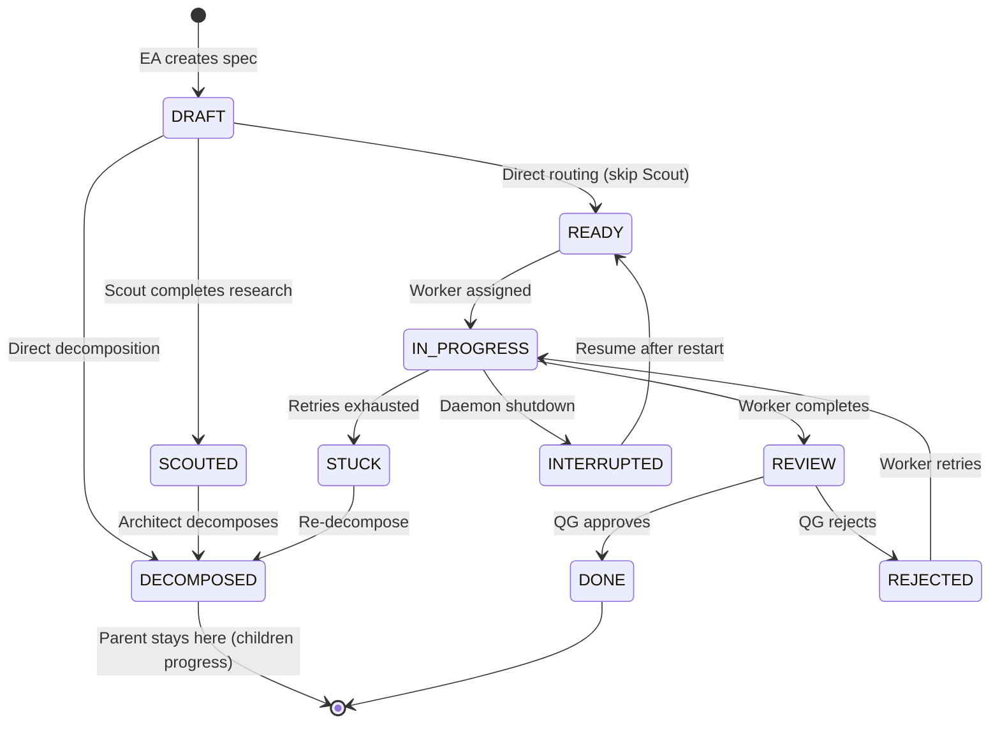
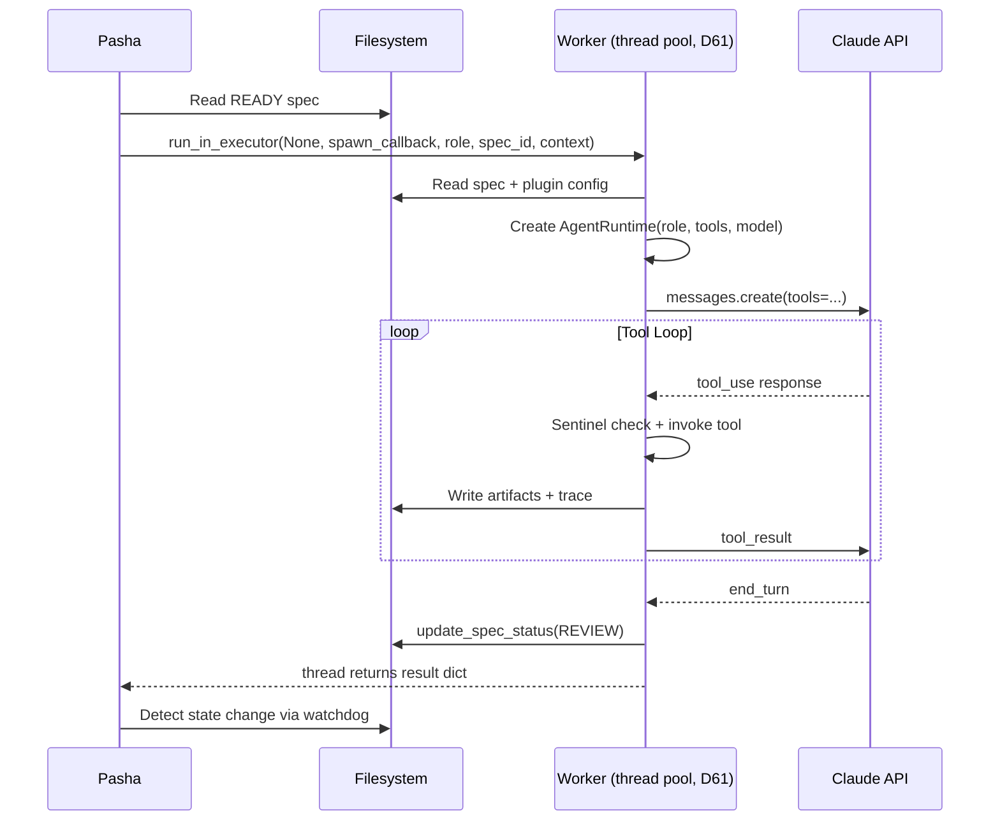

# Vizier Agent Communication Protocol

## 1. Overview & Philosophy

After the Agent System Reset (D46), all rigid prompt-in/response-out agents were deleted. This document defines the communication protocol for rebuilding agents as **tool-using, interactive Claude instances**.

**Core principle**: Each agent is a Claude API call with a system prompt, a set of tools, and a model tier. Claude reasons about the task, calls tools, sees results, and loops until done or blocked.

**Protocol structure**: Three machine-verifiable contracts, not text agreements:

- **Contract A** -- Message Schema: typed Pydantic models for all inter-agent communication
- **Contract B** -- Tool-use Policy: capabilities matrix defining what each role can do
- **Contract C** -- State Machine Invariants: formal conditions for every state transition

These contracts are testable. Every invariant maps to an assertion. Every message type has a schema. Every tool access rule is enforceable by Sentinel.

**Agent loop**: gather context -> act (tool calls) -> verify -> repeat (or escalate)

---

## 2. Contract A: Message Schema

All inter-agent communication uses **typed, structured messages**. Free text can be a field within a message, but never the canonical format. This eliminates the regex parsing that broke the first-generation agents.

Messages are Pydantic models defined in `libs/core/vizier/core/models/messages.py`. They are serialized as JSON and written to the spec directory on the filesystem (source of truth).

### Message Types

#### TASK_ASSIGNMENT

Sent by EA to Pasha, or Pasha to any inner-loop agent.

```json
{
  "type": "TASK_ASSIGNMENT",
  "spec_id": "001-jwt-auth",
  "goal": "Implement JWT authentication for the REST API",
  "constraints": ["Must use PyJWT library", "No breaking changes to existing endpoints"],
  "budget_tokens": 100000,
  "allowed_tools": ["read_file", "write_file", "edit_file", "bash", "run_tests", "git"],
  "assigned_role": "worker",
  "timestamp": "2026-02-19T10:00:00Z"
}
```

#### STATUS_UPDATE

Any agent reports progress to its supervisor.

```json
{
  "type": "STATUS_UPDATE",
  "spec_id": "001-jwt-auth",
  "state": "IN_PROGRESS",
  "progress": "Implemented token generation. Working on middleware.",
  "blockers": [],
  "next_step": "Write validation middleware",
  "confidence": 0.85,
  "tokens_used": 45000,
  "timestamp": "2026-02-19T10:15:00Z"
}
```

#### REQUEST_CLARIFICATION

Any agent asks its supervisor for information. Blocking requests halt work until answered.

```json
{
  "type": "REQUEST_CLARIFICATION",
  "spec_id": "001-jwt-auth",
  "question": "Should refresh tokens be stored in HTTP-only cookies or localStorage?",
  "options": ["HTTP-only cookies (more secure)", "localStorage (simpler)", "Both (let client choose)"],
  "blocking": true,
  "deadline": "2026-02-19T11:00:00Z",
  "context": "Security implications differ significantly between approaches",
  "timestamp": "2026-02-19T10:20:00Z"
}
```

#### PROPOSE_PLAN

Architect sends decomposition plan to Pasha for validation.

```json
{
  "type": "PROPOSE_PLAN",
  "spec_id": "001-jwt-auth",
  "steps": [
    {"sub_spec_id": "001-jwt-auth/001-data-model", "goal": "Add User model with password hashing", "complexity": "low", "write_set": ["src/models/**", "tests/models/**"]},
    {"sub_spec_id": "001-jwt-auth/002-token-service", "goal": "JWT token generation and validation", "complexity": "medium", "write_set": ["src/auth/**", "tests/auth/**"]},
    {"sub_spec_id": "001-jwt-auth/003-middleware", "goal": "Auth middleware for protected endpoints", "complexity": "medium", "write_set": ["src/middleware/**", "tests/middleware/**"], "depends_on": ["001-jwt-auth/001-data-model", "001-jwt-auth/002-token-service"]},
    {"sub_spec_id": "001-jwt-auth/004-integration", "goal": "Integration tests for full auth flow", "complexity": "low", "write_set": ["tests/integration/**"], "depends_on": ["001-jwt-auth/003-middleware"]}
  ],
  "risks": ["PyJWT version compatibility with Python 3.12"],
  "test_strategy": "Unit tests per sub-spec, integration test in final sub-spec",
  "timestamp": "2026-02-19T10:05:00Z"
}
```

Pasha runs a **deterministic DAG validator** on `depends_on` fields before accepting: no cycles (topological sort), all referenced IDs exist, no self-references.

#### ESCALATION

Any agent escalates a problem to its supervisor.

```json
{
  "type": "ESCALATION",
  "spec_id": "001-jwt-auth/002-token-service",
  "severity": "high",
  "reason": "PyJWT 2.x API changed significantly from 1.x. Spec references 1.x patterns.",
  "attempted": ["Tried PyJWT 2.9 API", "Checked migration guide", "Searched for alternatives"],
  "needed_from_supervisor": "Update spec with PyJWT 2.x API patterns or approve alternative library",
  "timestamp": "2026-02-19T10:30:00Z"
}
```

#### QUALITY_VERDICT

Quality Gate sends structured judgment with **mandatory evidence**.

```json
{
  "type": "QUALITY_VERDICT",
  "spec_id": "001-jwt-auth/001-data-model",
  "pass_fail": "PASS",
  "criteria_results": [
    {"criterion": "All tests pass", "result": "PASS", "evidence_link": "specs/001-jwt-auth/001-data-model/evidence/test_output.txt"},
    {"criterion": "No lint errors", "result": "PASS", "evidence_link": "specs/001-jwt-auth/001-data-model/evidence/lint_output.txt"},
    {"criterion": "Type check clean", "result": "PASS", "evidence_link": "specs/001-jwt-auth/001-data-model/evidence/pyright_output.txt"},
    {"criterion": "User model has password hashing", "result": "PASS", "evidence_link": "specs/001-jwt-auth/001-data-model/evidence/diff.patch"}
  ],
  "suggested_fix": [],
  "timestamp": "2026-02-19T10:45:00Z"
}
```

Evidence files are stored in `specs/NNN/evidence/` and must exist on disk. Pasha validates evidence completeness before accepting verdicts.

**Plugin-mandatory evidence types**:
- Software: `test_output`, `lint_output`, `type_check_output`, `diff`
- Documents: `link_check_output`, `structure_validation`, `rendered_preview_path`

#### RESEARCH_REPORT

Scout sends structured research findings.

```json
{
  "type": "RESEARCH_REPORT",
  "spec_id": "001-jwt-auth",
  "candidates": [
    {"name": "PyJWT", "source": "pypi", "url": "https://pypi.org/project/PyJWT/", "description": "JSON Web Token implementation", "license": "MIT", "relevance": "high"},
    {"name": "python-jose", "source": "pypi", "url": "https://pypi.org/project/python-jose/", "description": "JOSE implementation", "license": "MIT", "relevance": "medium"}
  ],
  "recommendation": "USE_LIBRARY",
  "confidence": 0.9,
  "search_queries": ["python jwt library", "python jwt authentication pypi"],
  "timestamp": "2026-02-19T10:03:00Z"
}
```

#### PING

Immediate supervisor notification (D50). Written as a file -- Pasha's watchdog detects it within ~100ms.

```json
{
  "type": "PING",
  "spec_id": "001-jwt-auth/002-token-service",
  "urgency": "BLOCKER",
  "message": "Cannot proceed without clarification on token expiry policy",
  "timestamp": "2026-02-19T10:25:00Z"
}
```

Urgency levels:
- `INFO` -- Picked up at next reconciliation cycle
- `QUESTION` -- Watchdog triggers immediate Pasha attention
- `BLOCKER` -- Immediate Pasha attention + EA escalation

### Golden Trace

Every message is appended to `specs/NNN/trace.jsonl` -- a per-spec timeline of all actions, tool calls, verdicts, and state transitions. This enables debugging multi-agent interactions and feeds the Retrospective agent.

```jsonl
{"ts": "...", "agent": "pasha", "type": "TASK_ASSIGNMENT", "spec_id": "001/001-data-model", "summary": "Assigned to worker"}
{"ts": "...", "agent": "worker", "type": "tool_call", "tool": "read_file", "args": {"path": "src/models/__init__.py"}, "result": "ok"}
{"ts": "...", "agent": "worker", "type": "tool_call", "tool": "write_file", "args": {"path": "src/models/user.py"}, "result": "ok"}
{"ts": "...", "agent": "worker", "type": "STATUS_UPDATE", "state": "REVIEW"}
{"ts": "...", "agent": "quality_gate", "type": "QUALITY_VERDICT", "pass_fail": "PASS"}
```

---

## 3. Contract B: Tool-use Policy

Each agent has a defined set of tools, enforced by Sentinel. The plugin provides domain-specific write-set boundaries.

### Tool Categories

**Domain Tools** (for agents that touch project files):

| Tool | Description | Implementation |
|------|-------------|----------------|
| `read_file(path)` | Read any project file | Direct file I/O |
| `write_file(path, content)` | Write to files within write-set | Sentinel enforces glob patterns |
| `edit_file(path, old, new)` | Precise text replacement | Sentinel enforces glob patterns |
| `bash(command, cwd)` | Run shell command | Wraps existing `ToolRunner` |
| `glob(pattern, path)` | Find files by pattern | Direct glob |
| `grep(pattern, path)` | Search file contents | Direct ripgrep |
| `git(command)` | Git operations | Sentinel classifies safe/dangerous |
| `run_tests(command)` | Run test suite | Wrapper over bash |
| `web_search(query)` | Search the web | For Scout, Document workers |

**Orchestration Tools** (for managers):

| Tool | Description | Who Uses |
|------|-------------|----------|
| `delegate_to_scout(spec_id)` | Trigger Scout for research | Pasha |
| `delegate_to_architect(spec_id)` | Trigger Architect for decomposition | Pasha |
| `delegate_to_worker(spec_id)` | Assign Worker to a READY spec | Pasha |
| `delegate_to_quality_gate(spec_id)` | Trigger QG for review | Pasha |
| `escalate_to_pasha(spec_id, reason)` | Worker/QG escalates | Worker, QG |
| `escalate_to_ea(spec_id, reason)` | Pasha escalates | Pasha |
| `request_more_research(spec_id, questions)` | Architect sends Scout back (D48) | Architect |
| `report_progress(project, data)` | Write status report | Pasha |
| `spawn_agent(role, spec_id, context)` | Start agent in thread pool (D61) | Pasha |

**State Tools** (for spec lifecycle):

| Tool | Description | Wraps |
|------|-------------|-------|
| `create_spec(project, id, content, frontmatter)` | Create new spec | `spec_io.create_spec()` |
| `update_spec_status(spec_path, new_status)` | Transition spec state | `spec_io.update_spec_status()` |
| `read_spec(spec_path)` | Read spec from disk | `spec_io.read_spec()` |
| `list_specs(project, status_filter)` | List specs | `spec_io.list_specs()` |
| `write_feedback(spec_id, content)` | Write feedback file | Direct file I/O |

**Communication Tools** (for structured messaging):

| Tool | Description | Who Uses |
|------|-------------|----------|
| `send_message(message)` | Emit typed message (Contract A) | All agents |
| `ping_supervisor(spec_id, urgency, msg)` | Immediate notification (D50) | Worker, QG, Architect |
| `send_briefing(content)` | Message Sultan via Telegram | EA |

### Tool Access Matrix

| Role | Domain | Orchestration | State | Communication |
|------|--------|---------------|-------|---------------|
| **EA** | read_file | -- | create_spec, read_spec, list_specs | send_message, send_briefing |
| **Pasha** | -- | delegate_*, escalate_to_ea, spawn_agent, report_progress | read_spec, update_spec_status, list_specs | send_message |
| **Scout** | read_file, web_search, bash (read-only) | -- | update_spec_status | send_message |
| **Architect** | read_file, glob, grep | request_more_research | create_spec, read_spec, update_spec_status | send_message, ping_supervisor |
| **Worker** | **ALL domain tools** | escalate_to_pasha | update_spec_status, write_feedback | send_message, ping_supervisor |
| **Quality Gate** | read_file, glob, grep, bash, run_tests | -- | update_spec_status, write_feedback | send_message, ping_supervisor |
| **Retrospective** | read_file, glob, grep | -- | read_spec, list_specs | send_message |

### Write-set Enforcement

Instead of a fixed artifact list per spec, the **plugin defines write-set boundaries as glob patterns**:

```yaml
# Software plugin write-set
worker_write_set:
  - "src/**/*.py"
  - "tests/**/*.py"
  - "docs/**/*.md"
  - "pyproject.toml"
  - "*.cfg"
  - "*.toml"

# Documents plugin write-set
worker_write_set:
  - "docs/**"
  - "templates/**"
  - "assets/**"
```

Sentinel matches every `write_file` / `edit_file` call against the write-set. Writes outside the pattern are denied. Individual specs can further restrict the write-set (e.g., only `src/auth/**`).

### EA Project Capability Summary

EA reads a per-project capability summary from the ProjectRegistry to make informed routing decisions without full plugin-awareness:

```yaml
# project_registry entry
project_alpha:
  plugin: software
  ci_signals: ["pytest", "ruff", "pyright"]
  done_definition: "All tests pass, lint clean, type check clean"
  critical_tools: ["bash", "git", "run_tests"]
  autonomy_stage: supervised
```

---

## 4. Contract C: State Machine Invariants

Formal conditions for every state transition. Each invariant is a test assertion.

### State Machine



### Transition Invariants

| Transition | Required Condition |
|---|---|
| DRAFT -> SCOUTED | `RESEARCH_REPORT` message exists in spec dir (or explicit skip with confidence > 0.8) |
| SCOUTED -> DECOMPOSED | `PROPOSE_PLAN` message exists AND Pasha's DAG validator accepted it |
| DRAFT -> DECOMPOSED | Same as above (direct path, skip Scout) |
| READY -> IN_PROGRESS | Worker AgentRuntime active AND monthly budget available AND `depends_on` specs all DONE |
| IN_PROGRESS -> REVIEW | Git commit hash exists AND modified files match write-set patterns |
| REVIEW -> DONE | `QUALITY_VERDICT` exists with `pass_fail: PASS` AND all plugin-mandatory evidence files exist on disk |
| REVIEW -> REJECTED | `QUALITY_VERDICT` exists with `pass_fail: FAIL` AND `suggested_fix[]` is non-empty |
| REJECTED -> IN_PROGRESS | Retry count < max_retries AND feedback file exists |
| IN_PROGRESS -> STUCK | Retry count >= max_retries |
| IN_PROGRESS -> INTERRUPTED | Daemon shutdown signal received |
| INTERRUPTED -> READY | Daemon restart + reconciliation |

### DAG Scheduling (D52)

Architect's `PROPOSE_PLAN` includes `depends_on` fields for sub-specs. Pasha enforces ordering:

1. All sub-specs are created as READY
2. Pasha's scheduler checks `depends_on` before assigning Workers
3. A READY spec with unmet dependencies stays in the queue (skipped)
4. When a dependency reaches DONE, Pasha re-evaluates the queue
5. Independent sub-specs can run in parallel

The DAG is validated at plan acceptance time (topological sort, no cycles, all IDs exist). This is deterministic -- no LLM needed.

### Evidence Requirements

Plugin declares mandatory evidence types. Pasha validates before accepting `QUALITY_VERDICT`:

```python
# Software plugin evidence requirements
required_evidence = {
    "test_output": "evidence/test_output.txt",      # pytest stdout
    "lint_output": "evidence/lint_output.txt",       # ruff check
    "type_check_output": "evidence/pyright_output.txt",  # pyright
    "diff": "evidence/diff.patch",                   # git diff
}
```

QG cannot produce a PASS verdict without all required evidence files existing on disk. This prevents LLM-only verdicts -- real tool output is mandatory.

---

## 5. SDK Integration Architecture

### D47: Anthropic Python SDK with tool_use

Use the `anthropic` Python package directly. Each agent is one tool_use loop:

```python
import anthropic

client = anthropic.Anthropic(api_key=secret_store.get("ANTHROPIC_API_KEY"))
messages = [{"role": "user", "content": task_assignment_prompt}]

while True:
    response = client.messages.create(
        model=model_router.resolve(role, complexity),
        system=system_prompt,
        tools=tool_set.definitions(),
        messages=messages,
        max_tokens=4096,
    )

    if response.stop_reason == "end_turn":
        break  # Agent finished

    if response.stop_reason == "tool_use":
        tool_results = []
        for block in response.content:
            if block.type == "tool_use":
                # Sentinel pre-check
                sentinel_result = sentinel.evaluate(make_request(block))
                if sentinel_result.decision == DENY:
                    tool_results.append(error_result(block.id, sentinel_result.reason))
                    continue
                # Invoke tool
                result = tool_invoker.run(block.name, block.input)
                tool_results.append(success_result(block.id, result))
                # Golden Trace + Loop Guardian
                trace.append(block.name, block.input, result)
                loop_guardian.check(block, result)

        messages.append({"role": "assistant", "content": response.content})
        messages.append({"role": "user", "content": tool_results})
```

### AgentRuntime Wrapper

`AgentRuntime` encapsulates the loop above and adds:

- **Sentinel PreToolUse hook**: Every tool call passes through `SentinelEngine.evaluate()` before running
- **Budget tracking**: Cumulative token usage per invocation, alerts at 80%/100% thresholds
- **Loop Guardian** (D51): Haiku checkpoint every N tool calls to detect spinning
- **Structured logging**: Token counts, costs, durations to `agent-log.jsonl`
- **Golden Trace**: Every tool call and message appended to `specs/NNN/trace.jsonl`
- **Model resolution**: Via existing `ModelRouter` (`libs/core/vizier/core/model_router/router.py`)
- **API key**: Via existing `SecretStore` (`libs/core/vizier/core/secrets/`)

---

## 6. Agent Lifecycle

### Spawning



### Running

The agent loop continues until one of:
1. **Clean completion**: Claude returns `stop_reason: "end_turn"` -- spec transitions to next state
2. **Escalation**: Agent calls `escalate_to_pasha` or `ping_supervisor(BLOCKER)` -- writes escalation file, exits
3. **Budget limit**: Token usage exceeds threshold -- agent writes partial progress, exits with status update
4. **Loop Guardian HALT**: Detected spinning -- forces escalation to Pasha
5. **Crash**: Subprocess exits non-zero -- Pasha detects, increments retries

### Termination

| Exit Type | Spec Transition | Action |
|---|---|---|
| Clean (Worker) | IN_PROGRESS -> REVIEW | Commit created, artifacts written |
| Clean (QG) | REVIEW -> DONE or REJECTED | QUALITY_VERDICT written with evidence |
| Clean (Scout) | DRAFT -> SCOUTED | RESEARCH_REPORT written |
| Clean (Architect) | SCOUTED -> DECOMPOSED | PROPOSE_PLAN accepted, sub-specs created |
| Escalation | Stays in current state | Escalation file written, Pasha handles |
| Budget exceeded | Stays in current state | STATUS_UPDATE with progress, re-queued |
| Crash (non-zero exit) | Stays in current state | Pasha detects, retries per D25 |
| HALT (Loop Guardian) | Stays in current state | Escalation written, agent killed |

### Fresh Context Guarantee

Each agent invocation creates a new AgentRuntime instance in the daemon thread pool (D61). No shared memory between invocations -- each runtime gets a fresh message list. All state is read from disk at start and written to disk at end. The tool_use loop creates a fresh Claude conversation per invocation. The Anthropic client (httpx) is thread-safe and shared across invocations.

---

## 7. Supervision & Monitoring

### Sentinel (PreToolUse)

Every tool call passes through `SentinelEngine` before running:
1. **Allowlist** (zero cost) -- instant ALLOW for known-safe calls
2. **Denylist** (zero cost) -- instant DENY for known-dangerous calls
3. **Secret scanner** (zero cost) -- DENY if secrets detected in arguments
4. **Git classifier** (zero cost) -- classify git operations as safe/dangerous
5. **Haiku evaluator** (~$0.001) -- for ambiguous calls

Denied calls return an error to Claude. Claude sees the denial reason and must adapt (try alternative approach) or escalate.

### Loop Guardian (D51)

Integrated into `AgentRuntime`. Detects agents spinning without progress:

**Deterministic detection** (zero cost):
- Identical tool calls repeated 3+ times -> immediate HALT

**LLM checkpoint** (every N tool calls, default 5):
- Sends last N tool calls + results to Haiku (~$0.001 per checkpoint)
- Haiku evaluates: "Is this agent making progress?"
- Returns: CONTINUE / WARN (log, continue) / HALT (force escalation)

### Budget Monitoring

- Token usage tracked per agent invocation by `AgentRuntime`
- Monthly budget tracked in `reports/budget.json`
- Thresholds from D33:
  - 80%: EA alerts Sultan
  - 100%: All agents degraded to cheapest tier (Haiku)
  - 120%: Hard stop, no new agent invocations

### QG Tier Escalation (D49)

For specs with `complexity: high`, Quality Gate automatically uses Opus tier for semantic passes (3-5). Mechanical passes (1-2) always use Sonnet. This prevents the "blind leading blind" problem where Sonnet-QG misses Sonnet-Worker's logic errors.

Additionally, QG **must call `run_tests`** before any LLM-assisted pass. Test output is real evidence, not LLM judgment.

### Adaptive Reconciliation (D58)

Pasha's reconciliation interval adapts to activity:
- **Active** (specs in IN_PROGRESS or REVIEW): 5-10s
- **Baseline**: 15s (current default)
- **Idle** (no active specs): 30s -> 60s -> 120s (exponential backoff)

Watchdog events still fire near-instantly for file changes. Reconciliation is the backup sweep.

---

## 8. Error Handling

### Tool Errors

When a tool returns an error, Claude receives it as a `tool_result` with `is_error: true`. Claude should:
1. Try an alternative approach (different command, different file, etc.)
2. If repeated failures (3+), escalate via `ping_supervisor(BLOCKER)`
3. Never repeat the exact same failing call (Loop Guardian catches this)

### Sentinel Blocks

When Sentinel denies a tool call, Claude receives: "Permission denied: [reason]". Claude must:
1. Find an alternative approach that doesn't trigger Sentinel
2. If no alternative exists, escalate with reason in `ESCALATION` message
3. Never attempt to bypass Sentinel (denylist patterns are hard blocks)

### Budget Exhaustion

- At 80% of invocation budget: AgentRuntime logs warning, continues
- At 100%: AgentRuntime forces clean exit -- writes STATUS_UPDATE with progress
- Agent is re-queued with remaining budget in next invocation
- Monthly budget thresholds trigger tier downgrades (D33)

### Agent Crash Recovery

1. Pasha detects agent failure (thread pool exception or error result)
2. Spec retries incremented (existing `retries` field in frontmatter)
3. If retries < max_retries: spec stays in current state, re-queued
4. If retries >= max_retries: spec transitions to STUCK
5. At retry 3: model tier bumped (e.g., Sonnet -> Opus) per graduated retry (D25)
6. Reconciler catches missed events on daemon restart (D22)

---

## 9. Integration with Existing Infrastructure

### File Protocol

Tool implementations are thin wrappers around existing `spec_io` functions:

| Tool | Wraps | File |
|------|-------|------|
| `create_spec` | `spec_io.create_spec()` | `libs/core/vizier/core/file_protocol/spec_io.py` |
| `update_spec_status` | `spec_io.update_spec_status()` | Same |
| `read_spec` | `spec_io.read_spec()` | Same |
| `list_specs` | `spec_io.list_specs()` | Same |
| `write_feedback` | Direct file I/O to `specs/NNN/feedback/` | New |

Atomic writes via `os.replace()` are preserved (D40). The `depends_on` field is added to `SpecFrontmatter` as an optional `list[str]`.

### Plugin System

`BasePlugin` is extended with:
- `worker_write_set: list[str]` -- glob patterns for Worker write boundaries
- `required_evidence: dict[str, str]` -- mandatory evidence types for QG verdicts
- `system_prompts: dict[str, str]` -- per-role system prompt templates
- `tool_overrides: dict[str, list[str]]` -- per-role tool additions/removals

Plugin discovery via entry points is unchanged.

### Sentinel

`SentinelEngine.evaluate()` is called in the AgentRuntime loop before every tool call. The existing pipeline (allowlist -> denylist -> secrets -> git -> haiku) works unchanged. Write-set enforcement is added as a new policy stage between denylist and secret scanner.

### Watcher / Reconciler

Unchanged. Pasha's event loop is driven by:
1. **Watchdog** (primary): filesystem events fire within ~100ms
2. **Reconciler** (backup): periodic sweep at adaptive intervals (D58)

The `ping_supervisor` tool writes a file that watchdog detects. No new IPC mechanism needed.

### ModelRouter

Returns model strings for the Anthropic API instead of LiteLLM aliases:
- `opus` -> `claude-opus-4-6` (EA, Architect, Pasha, HIGH-complexity QG)
- `sonnet` -> `claude-sonnet-4-6` (Worker, Scout, QG)
- `haiku` -> `claude-haiku-4-5-20251001` (Loop Guardian checkpoints, Sentinel evaluator)

---

## 10. Architectural Alternatives

Documented for future reference. Not implemented now.

### Scout + Architect Merge ("Planner")

**Idea**: Combine Scout and Architect into a single "Planner" agent that researches and decomposes in one pass.
**Pro**: Fewer handoffs, less state, fewer failure modes.
**Con**: Wider context may reduce discipline; harder to test isolation.
**When to consider**: If Scout frequently provides zero value (SKIP path dominates).

### Event Log vs Filesystem Bus

**Idea**: Replace filesystem-as-message-bus with an append-only event log + materialized state views.
**Pro**: Perfect audit/replay, better concurrency, fewer race conditions.
**Con**: Larger implementation effort, new infrastructure.
**When to consider**: If filesystem watcher limitations emerge (event storms, Windows reliability issues).

### Overseer as Full Agent

**Idea**: Dedicated monitoring agent that watches all other agents in real-time.
**Pro**: Separates "do work" from "police work."
**Con**: Additional cost, potential false positives.
**When to consider**: When Loop Guardian (D51) + Sentinel prove insufficient -- e.g., agents consistently drift from spec scope without triggering either mechanism.
